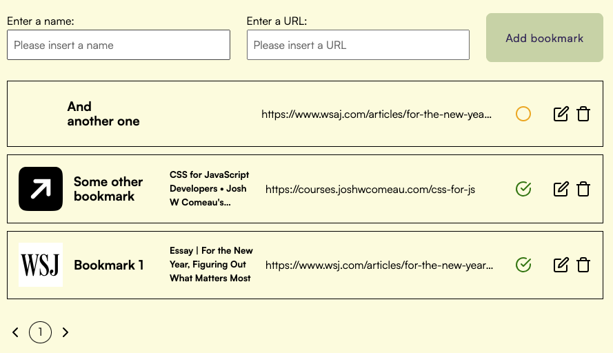

# Phantom code task

This is my attempt at the Phantom developer test! \
It's a simple app that collects your bookmarks, stores them locally and decorates them. 

The app uses Typescript, React, Framer motion for animations, Zustand for state management, OpenGraph.io for retrieveing metadata, react-feather for icons and dayjs for smaller dates manipulation.

In its essence, the app is a simple form to collect bookmarks, which are stored in the browser's local storage using Zustand. These are then enriched by adding metadata, when available, which is fetched when a site is added, edited, or after 7 days of being stored.

**N.B.** Due to time costraints, this website was designed as a desktop-only experience.
